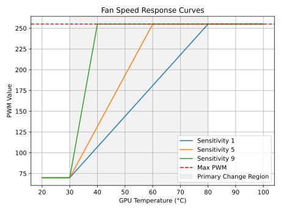

# NV Fan Control

A small utility I wrote to control the custom cooling's 12v fan speed on my Nvidia Tesla P100.

My mainboard is a ASRock x670 Pro RS (sorry, not turbo or intercooler) which uses an NCT 6775 controller.

## Usage

```shell
nv_fan_control --help
```

## Installation

```shell
go build nv_fan_control.go
chmod +x nv_fan_control
mv nv_fan_control /usr/local/sbin/
```

You may also want to create a systemd service to run this at boot and in the background.

```shell
cp nv_fan_control.service /etc/systemd/system/
systemctl daemon reload
systemctl enable nv_fan_control.service --now
```

## NCT 6775 + Fedora 38

```shell
cat /etc/modprobe.d/am5-sensors.conf
options nct6775 force_id=0xd420 force
```

## Logic

\[ PWM = \frac{TEMP - x_1}{x_2 - x_1} \times (y_2 - y_1) + y_1 \]

Given:

\[ x_1 = 30 \]
\[ y_1 = basePWM \]
\[ x_2 = 80 - (fanSensitivity-1) \times 5 \]
\[ y_2 = maxPWM \]

Assuming:

1. \( basePWM = 70 \)
2. \( maxPWM = 255 \)
3. We will consider \( fanSensitivity \) values of 1, 5, and 9 for comparison.

We will consider fanSensitivity values of 1, 5, and 9 for comparison.

The curves will provide insight into how the fan speed ramps up based on GPU temperature for different sensitivity values.

Consider the following for each sensitivity value:

1. **Sensitivity 1**: \( x_2 = 80 \)
\[ PWM = \frac{TEMP - 30}{80 - 30} \times (255 - 70) + 70 \]

1. **Sensitivity 5**: \( x_2 = 60 \)
\[ PWM = \frac{TEMP - 30}{60 - 30} \times (255 - 70) + 70 \]

1. **Sensitivity 9**: \( x_2 = 40 \)
\[ PWM = \frac{TEMP - 30}{40 - 30} \times (255 - 70) + 70 \]

To visualise:

- For Sensitivity 1: The curve will gradually rise, reaching its maximum fan speed at a GPU temperature of 80°C.
- For Sensitivity 5: The curve will be steeper, hitting the maximum fan speed at a GPU temperature of 60°C.
- For Sensitivity 9: The curve will be very steep, reaching maximum fan speed by 40°C.


